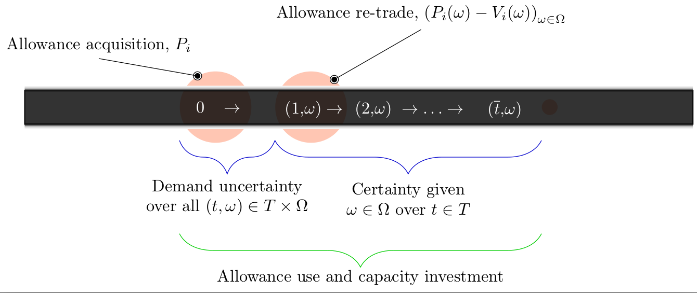
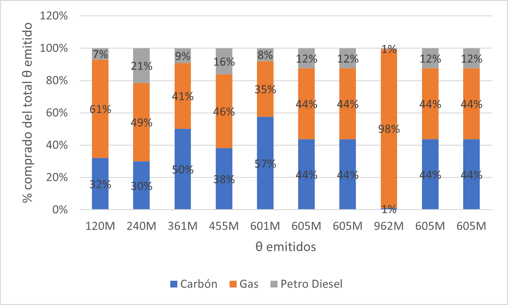
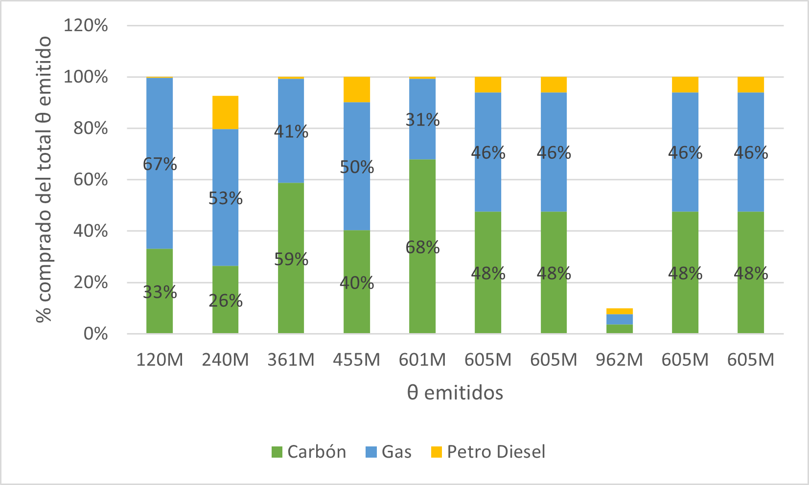

```{r setup, include=FALSE}
# Suppress the version number in the subdirectory name
options(htmltools.dir.version = FALSE)

# Define how figures are displayed
knitr::opts_chunk$set(
  echo = FALSE,
  warning = FALSE,
  message = FALSE,
  fig.align = "center"
)

# Add option of showing tile overview by pressing "o"
xaringanExtra::use_tile_view()

# Add option to write over slides
xaringanExtra::use_scribble()

# Biblio setup
library(RefManageR)
BibOptions(check.entries = FALSE,
           bib.style = "authoryear",
           cite.style = "authoryear",
           style = "markdown",
           hyperlink = TRUE,
           dashed = FALSE
           )
# mybib <- ReadBib("~/Dropbox/Investigacion/NGOEfficiency/biblio.bib", check = FALSE)
zoterokey<- Sys.getenv("zoterokey")
zoteroID<- Sys.getenv("zoteroID")
# mybib <- ReadZotero(user = zoteroID, .params=list(key = zoterokey, q="Amigo")) + ReadZotero(user = zoteroID, .params=list(key = zoterokey, q="Dewan")) + ReadZotero(user = zoteroID, .params=list(key = zoterokey, q="smeers"))
# mybib <- mybib + ReadZotero(user = zoteroID, .params=list(key = zoterokey, q="cea-echenique"))
# + ReadZotero(user = zoteroID, .params=list(key = zoterokey, q="Gradstein")) + ReadZotero(user = zoteroID, .params=list(key = zoterokey, q="Nocetti"))  + ReadZotero(user = zoteroID, .params=list(key = zoterokey, q="Nitzan"))

# WriteBib(mybib, file="referencesPres.bib")
mybib <- ReadBib("referencesPres.bib")
```


# Outline

.pull-left[
- [Motivation](#motivation)
- [Model](#model)
- [Results](#results)
]

 


---
name: motivation
# Motivation

- Decarbonization
  - Contrast Tax versus Cap-and-trade
  - Carbon pricing
- Environment resposability as an attention problem

---
name: literature
# Literature

- 2-stage stochastic capacity investment problems

`r Cite(mybib, c("ehrenmann_stochastic_2011","abada_multiplicity_2017","de_maere_d__aertrycke_risk_2017"))`
- Re-trading: `r Citet(mybib, "amigo_two_2021")`
- Investment segmentation: `r Citet(mybib, "cea-echenique_general_2018")`
- Rational Inattention: `r Citet(mybib, "dewan_estimating_2020")`
---
name: model
# Model

```{r timeline, out.width='80%'}

```
.pull-left[
- $\bar t$ periods indexed by $T$
- $\Omega$ finite set of states of nature
]

.pull-right[
- $P$ allowance long position
- $V$ allowance short position
]
---
name: demand
# Demand

In the first stage period $t=0$, 

- Exogenous demand $D(0)\in\mathbb{R}_+$. 

In the second stage $t\in T:=\{1,...\bar{t}\}$, $\omega\in\Omega$
- Probability $Pr(\omega)\in[0,1]$. 
- Exogenous stochastic demand level $D(t,\omega)\in\mathbb{R}_+^{T\times\Omega}$,  $D=\left(D(0),(D(t,\omega))_{(t,\omega)\in T\times\Omega}\right)\in\mathbb{R}_+\times\mathbb{R}_+^{T\times\Omega}$.
---
name: producers
# Producers: first stage

$t=0$, each producer $i$ chooses 
- $Q_i(t)\in\mathbb{R}_+$ generation quantity such that their revenue is maximized price $\pi^d(0)\in\mathbb{R}_+$
- $\bar{Q}_i$ installed capacity for each producer at $t=0$
- $A_i\in\mathbb{R}_+$ carbon allowances  at a price $\pi^{a}\in\mathbb{R}_+$
- $x_i(t)\in\mathbb{R}_+$ additional capacity  with a capital expenditure of $I_i\in\mathbb{R}_+$ (The additional capacity becomes available after a predefined building time (in years))
---
name: producers2
# Producers: second stage

In the second stage, for each pair $(t,\omega)$, producer $i$ maximizes its profit by choosing 
- $Q_i(t,\omega)\in\mathbb{R}_+$ the generation level at a price $\pi^d(t,\omega)\in\mathbb{R}_+$
- $TC_i(t) \in\mathbb{R}_+$ technology change that adjusts the marginal cost of different technologies. 
- $x_i(t,\omega)\in\mathbb{R}_+$ additional capacity  with an investment cost of $TCR_i(t)\cdot I_i$, where $TCR_i(t)\in\mathbb{R}_+$ is the change in the investment cost or capital expenditure over time
- $P_i(\omega)\in\mathbb{R}_+$ long position in permits from other producers if they need to surpass the initial allowances allocation $A_i$
- $V_i(\omega)\in\mathbb{R}_+$ short position in allowances
- $\pi^v(\omega)\in\mathbb{R}_+$ permits retrade price
---
name: producers3
# Producers

The choice set of the producer $i$ over a time horizon of $\bar{t}$ years is given by: 
- an amount of capacity expansion $x_i:=\left(x_i(0),(x_i(t,\omega))_{(t,\omega)\in T\times\Omega}\right)\in\mathbb{R}_+\times\mathbb{R}_+^{T\times\Omega}$, 
- a production plan $Q_i:=\left(Q_{i}(0),(Q_{i}(t,\omega)_{(t,\omega)\in T\times\Omega})\right)\in\mathbb{R}_+\times\mathbb{R}_+^{T\times\Omega}$, 
- allowances $A_i\in\mathbb{R}_+$ bought in the first period $t=0$, 
- allowances $P_i(\omega)\in\mathbb{R}_+^{\Omega}$ bought in $t=1$ for time interval $t\in[1,\bar{t}]$
- allowances $V_i(\omega)\in\mathbb{R}_+^{\Omega}$ sold in $t=1$ for time interval $t\in[1,\bar{t}]$.

Given electricity prices $\pi^d:=\left(\pi^d(0),\left(\pi^d(t,\omega)\right)_{(t,\omega)\in T\times\Omega}\right)\in\mathbb{R}_+\times\mathbb{R}_+^{T\times\Omega}$ and parameters $(a_i,b_i)_{i\in\{1,...N\}}\in(\mathbb{R}^2_+)^N$, $f_i(p,q)=\Big(a_i\cdot q+\frac{b_i}{2}\cdot q^{2}\Big)-p\cdot q$ revenue function.
---
name: producers4
# Producers: Objective

Defining $T_0:=\{0\}\cup T$, the optimization problem of producer $i$ is given by choosing
$(x_i,Q_i, A_i,P_i,V_i)\in\mathbb{X}:=\left(\mathbb{R}_+\times\mathbb{R}_+^{T\times\Omega}\right) \times\left(\mathbb{R}_+\times\mathbb{R}_+^{T\times\Omega}\right) \times \mathbb{R}_+\times\mathbb{R}_+^{\Omega}\times\mathbb{R}_+^{\Omega}$ given prices $(\pi^d$, $\pi^a$ , $\pi^v)\in\Pi:=\left(\mathbb{R}_+\times\mathbb{R}_+^{T\times\Omega}\right)\times\mathbb{R}_+\times\mathbb{R}^{\Omega}_+$ and parameters $\left((a_i,b_i),I_i, TC_i(t,\omega), TCR_i(t,\omega), CF_i,\bar{Q}_i, RP_i , \varepsilon_i\right)\in \Xi:=\mathbb{R}_+^2\times\mathbb{R}_+^7$, $\tau\in \mathbb{R}_+$ and probability $(Pr(\omega))_{\omega\in\Omega}\in\Delta:=\left\{\left(Pr(\omega)\right)_{\omega\in\Omega}\in[0,1]^K:\sum_{\omega\in\Omega}Pr(\omega)=1\right\}$ as a solution of

$$\min_{(x_i,Q_i,A_i,P_i,V_i)\in \mathbb{X}}   f_i \big( \pi^d(0),Q_i(0)\big)+ A_i \pi^{a} + I_i x_i(0)$$

$$+ \sum_{\omega} Pr(\omega)   \Bigg[ \sum_{t>0} \frac{1}{(1+R)^t} \Big[ TC_i(t)\cdot f_i \big( \pi^d(t,\omega),Q_i(t,\omega) \big)$$

$$+ TCR_i(t) \cdot I_i\cdot x_i(t,\omega) \Big] + \pi^v(\omega)\cdot \big(P_i(\omega)-V_i(\omega)\big) \Bigg] $$
---
name:prodrest
# Producers: Restrictions

$$\Big(CF_i \cdot\tau\Big)  \Bigg[\bar{Q}_i + x_i(0)+\sum_{t^{\prime}<t-lag_i} x_i(t^\prime,\omega) \Bigg] - Q_i(t,\omega) \geq 0   \quad \forall \quad i,\omega, t  > 0  \quad (\alpha_{i,\omega,t})$$

$$(CF_i\cdot\tau)\bar{Q}_i-Q_i(0)\geq 0 \qquad \forall \quad i\quad (\kappa_i)$$
$$RP_i - \bar{Q}_i - x_i(0) - \sum_{t > 0} x_i(t,\omega) \geq 0  \qquad \forall \quad i,\omega       \quad (\psi_{i,\omega})$$

$$A_{i}-V_i(\omega)\geq  0 \qquad \forall \quad i,\omega \quad (\beta_{i,\omega})$$

$$A_{i} + (P_i(\omega) - V_i(\omega))-\sum_{t>0}Q_i(t, \omega)\cdot \varepsilon_{i}-Q_i(0)\varepsilon_{i}           \geq  0  \qquad \forall \quad i, \omega     \quad (\gamma_{i,\omega})$$
---
name: auctioneer
# Auctioneer: Amigo et alii (2021)

- $\theta\in \mathbb{R}_+$ available allowances at a price $\pi^a$ in stage $t=0$. 
- The price is set such that it clears the $CO_2$ permit market among generators and the auctioneer. 
- $CAP\in\mathbb{R}_+$ carbon budget (maximum level of $CO_2$ emissions allowed in the second stage $t\in T$) and is drawn from a normal distribution, i.e., $CAP \thicksim N(\mu, \sigma^2)$.

$$Pr(\theta \geq CAP) \leq \epsilon$$

- Objective
$$\min_{\theta} -\theta \pi^{a}  + \mathcal{F}(\theta)\quad\text{s.t }\quad\phi^{-1}(\epsilon) \sigma + \mu - \theta  \geq 0$$
---
name: equilibrium
# Equilibrium

The data that parameterize the capacity investment model is given by the tuple $$\left(\tau,(Pr(\omega))_{\omega\in\Omega},\left(CAP,\mu,\sigma,\epsilon\right),\left((a_i,b_i),I_i, TC_i(t,\omega), TCR_i(t,\omega), CF_i,\bar{Q}_i, RP_i , \varepsilon_i\right)_{i\in N}\right)$$
$$\in \mathbb{R}_+\times \Delta\times\mathbb{R}_+^4\times\Xi^N,$$

**DEFINITION.** An equilibrium in the capacity investment model is a vector of prices and production decisions $$\left((\pi^{d*},\pi^{a*},\pi^{v*}),(x_i^*,Q_i^*,A_i^*,P_i^*,V_i^*)_{i\in\{1,...,N\}},\theta^*\right)\in\Pi\times\mathbb{X}^N \times \mathbb{R}_+$$ such that:
---
name: eqcond
# Equilibrium: conditions

- $(x_i^*,Q_i^*,A_i^*,P_i^*,V_i^*)$ minimizes the cost for each producer  $i\in\{1,...,N\}$
- $\theta^*$ minimizes the auctioneer cost
- Market clearing conditions are satisfied:

.pull-left.small[
- available allowances $t=0$
$$\sum_{i} A_{i}^* = \theta   \ \  (\pi^{a*})$$
- equilibrium in trading market $t>0$
$$\sum_{i} P_{i,\omega}^* = \sum_{i} V_{i,\omega}^*  \forall \ \omega  \ \ \left(\pi^{v*}(\omega)\right)$$
]

.pull-right.small[

- fulfillment of the demand --first stage
$$\sum_{i} Q_i(0)^* = D(0), \ \ (\pi^{d*}(0))$$
- fulfillment of the demand --second stage
$$\sum_{i} Q_i(t,\omega)^* = D(t,\omega),  \forall \ \omega, t \quad(\pi^{d*}(t,\omega))$$ 
]  
---
name: attention
# Rational Inattention

Following `r Citet(mybib, "dewan_estimating_2020")` we consider a quadratic cost function

$$C(P)=\begin{cases}0,&Perf\leq d\\c(Perf-d)^2,&Perf>d\end{cases},$$

where $Perf\in[0,1]$ is a performance metric, $c$ an associated marginal cost and $d$ the performance level wiht public information.

We drop the chance constraint approach, by using

- $\min_{(\theta,Perf)\in[0,(1+\epsilon)CAP]\times[0,1]}-\theta\pi^aPerf+c(Perf-d)^2$ profit oriented
- $\min_{\theta\in[0,CAP]}-\theta\pi^a+c\left(1-\frac{|\theta-CAP|}{CAP}-d\right)^2$ welfare oriented
---
name: results
# Results: Profit oriented
.pull-left[
- Calibration wrt `r Citet(mybib, "amigo_two_2021")`
  - CAP: $100 MtCO_2$
  - $\pi^a=315.83$
  - $\epsilon=0.202$ Andres et alii (2014)
$$\Rightarrow c=920M$$ 
]
.pull-right.center[
$CAP=100$

| Perf | $\theta$    | $\frac{\theta}{CAP}$ | $\pi^a$  |
|---------|-------------|----------------------|----------|
| 0.798   | 120,200,000 | 1.20                 | 270.13 |
| 0.8     | 120,200,000 | 1.20                 | 270.13 |
| 0.85    | 113,654,321 | 1.14                 | 25.75  |
| 0.9     | 113,568,965 | 1.14                 | 93.65  |
| 0.95    | 118,470,479 | 1.18                 | 188.86 |
| 0.99    | 114,916,396 | 1.15                 | 298.11 |
| 1       | 118,332,486 | 1.18                 | 317.24 |
]

---
# Results: Profit oriented and multiple CAPs, $Perf=0.8$

| CAP           | $\theta$    | $\frac{\theta}{CAP}$ | $\pi^a$  |
|---------------|-------------|----------------------|----------|
| 100,000,000   | 120,200,000 | 1.20                 | 270.13 |
| 200,000,000   | 240,400,000 | 1.20                 | 60.57  |
| 300,000,000   | 360,600,000 | 1.20                 | 119.47 |
| 400,000,000   | 454,798,037 | 1.14                 | 95.83  |
| 500,000,000   | 601,000,000 | 1.20                 | 79.31  |
| 600,000,000   | 605,279,899 | 1.01                 | 66.57  |
| 700,000,000   | 605,279,899 | 0.86                 | 56.37  |
| 800,000,000   | 961,600,000 | 1.20                 | 152.50 |
| 900,000,000   | 605,279,899 | 0.67                 | 42.26  |
| 1,000,000,000 | 605,279,899 | 0.61                 | 35.98  |
---
# Results: Profit oriented, allowances distributions

.pull-left[
```{r dist1, out.width="100%"}

```
]

.pull-right[
```{r dist2, out.width="100%"}

```
]


---
name: resultsW
# Results: Welfare oriented
.pull-left[
- Calibration wrt `r Citet(mybib, "amigo_two_2021")`
  - CAP: $100 MtCO_2$
  - $\pi^a=315.83$

$$\Rightarrow c=9920M$$ 
]
.pull-right.center[
| CAP  (M)         | $\theta$    | Perf | $\frac{\theta}{CAP}$ | $\pi^a$  |
|---------------|-------------|---------|----------------------|----------|
| 100   | 144,944,410 | 0.798   | 1.449                | 232.82 |
| 200   | 289,888,820 | 0.798   | 1.449                | 141.56 |
| 300   | 434,833,230 | 0.798   | 1.449                | 103.33 |
| 400   | 579,777,640 | 0.798   | 1.449                |    |
| 500   | 653,754,577 | 0.905   | 1.308                | 37.27  |
| 600   | 619,939,821 | 0.999   | 1.033                | 40.43  |
| 700   | 661,258,561 | 0.997   | 0.945                | 36.42  |
| 800   | 610,913,181 | 0.944   | 0.764                | 31.28  |
| 900   | 609,127,279 | 0.896   | 0.677                | 31.21  |
| 1,000 | 698,676,376 | 0.909   | 0.699                | 30.00  |
]
---
class: middle
name: remarks
# Final Remarks

- Respect of aggregate demand law
- Unclear relation of inattention
- Multiple solutions and comparative statics


---
name: references
# References

.pull-left[
.small[
```{r refsI, echo=FALSE, results="asis"}
PrintBibliography(mybib, .opts = list(check.entries = TRUE), start=1, end=2)
```
]
]

.pull-right[
.small[

```{r refsII, echo=FALSE, results="asis"}
PrintBibliography(mybib, .opts = list(check.entries = TRUE), start=3, end=5)
```
]
]


---
name: references2
# References II


```{r refsIII, echo=FALSE, results="asis"}
PrintBibliography(mybib, .opts = list(check.entries = TRUE), start=6, end=7)
```


